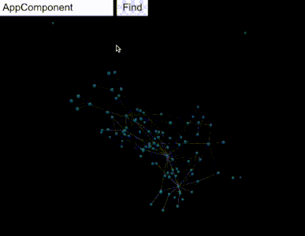

# Foobar

Simple 3D visualiser of Angular project components and their relationships<br><br>



## Installation

Checkout this project to your machine and install it as npm package inside your Angular project.
```
npm install /path/to/project-visualiser
```

## Usage

Run this command inside your Angular project.
```
ng-visualize
```
Open browser at http://127.0.0.1:8080/.

Double click on graph node to open selected component in VSCode.


## Contributing
Pull requests are welcome. For major changes, please open an issue first to discuss what you would like to change.

Please make sure to update tests as appropriate.

## License
[MIT](https://choosealicense.com/licenses/mit/)